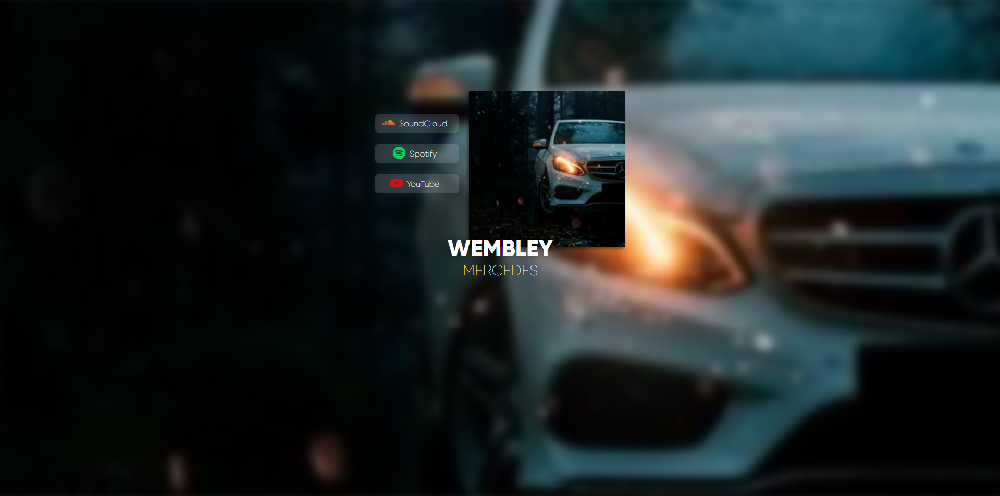
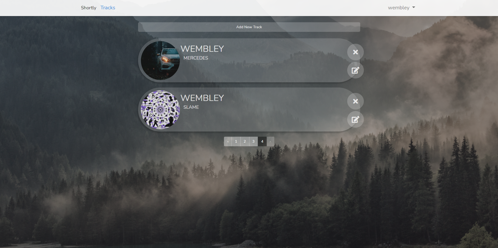
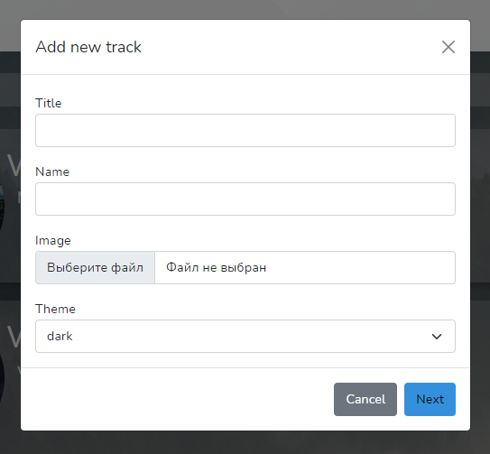
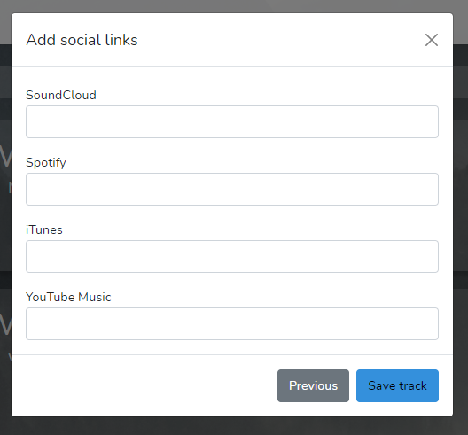
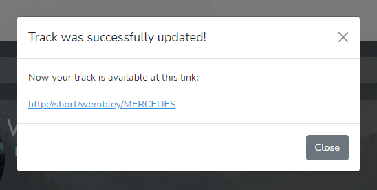
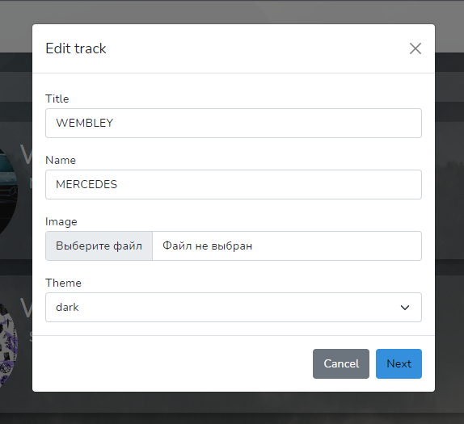
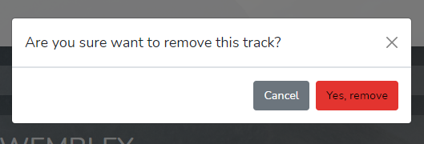

# Muse.cute

Muse.cute - сервис для хранения ссылок на музыкальные площадки. По сути простенький AJAX CRUD.

Исполнитель выпускает трек, и вместо того, чтобы давать слушателем 5 разных ссылок на SoundCloud, iTunes и тд. - он даёт одну единственную, которая хранит их в себе.

Проект разрабатывался неделю, по вечерам после работы и на выходных. В общей сложности ушло примерно 40 часов, точно сказать не могу поскольку не замерял. 

## Страница с треком

Да, над дизайном я тут поработал, поскольку захотелось чего-то необычного. Верстал проект на Bootstrap 5 с использованием jQuery и переходом на JavaScript в местах где jQuery был неприменим. Мобильную верстку не делал, первостепенная задача проекта - показать мои навыки работы с PHP, Laravel, JS.

Роут формируется динамически, в зависимости от исполнителя и названия трека, поскольку я хотел чтобы ссылка выглядела красиво а не состояла из набора рандомных букв и цифр. 

Сейчас паттерн следующий - {site_url}/{username}/{trackname}.

## Страница с треками в админке

Тут я тоже поработал над дизайном, поскольку в будущем буду сам использовать этот сервис, а мне важно чтобы сайт был красивый.

По сути админка имеет один единственный раздел, где выводится список треков, и кнопка выхода, при нажатии на имя пользователя.

Треки можно добавлять, редактировать и удалять. Изначально я хотел сделать всё на модалках и AJAX, но столкнулся с проблемой, что сейчас нет легкого способа передавать загруженные в форму файлы на сервер. 

Хотя, если быть точным, то с недавних пор можно, - с помощью FormData(), но я решил не тратить время на его изучение и просто сделал обычную форму с перезагрузкой страницы.

После добавления/удаления/редактирования появляется модальное окно, которое сообщает пользователю об успешности его действия.

Серверные ошибки я на фронте никак красиво не обрабатывал, и в случае чего, просто выскакивает текст на белом фоне, аля "Вы не передали файл".

### Добавление трека

Как можно заметить, тут присутствует выбор цветовой схемы страницы, поскольку если обложка будет тёмная, то белый текст смотрится нормально. Но если она будет белая, то ничего видно не будет. Поэтому было добавлено 2 темы, а вернее 2 css файла, и подключается один единственный в зависимости от выбранной темы.

Была идея определять тему автоматически отталкиваясь от пикселей на картинке, и я даже нашёл библиотеку реализованную на PHP которая этим занимается, но решил не усложнять проект.

Затем следует вторая страница, где мы указываем площадки где размещён трек.

После успешного добавления трека в БД, страничка обновляется и появляется модальное окошко, в котором хранится ссылка на трек.

### Редактирования трека

Тут я решил не мудрить, и просто AJAX`ом получил данные трека опираясь на его имя (в БД оно уникальное) по клику на кнопку редактирования и заполнил поля в модалке после чего показал её, изменив URL формочки.

### Удаление трека

